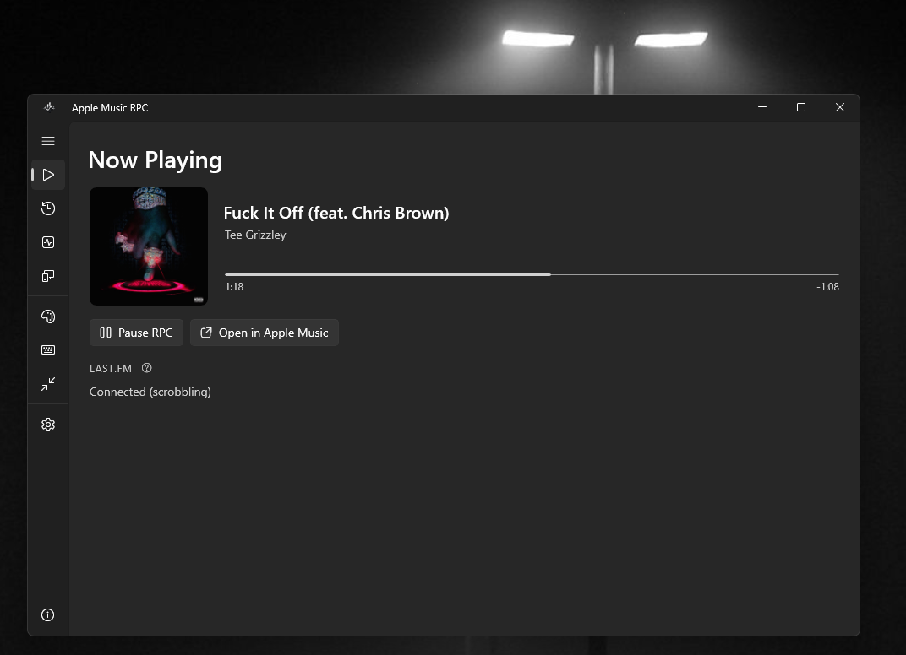

# Apple Music Discord Rich Presence

Display your Apple Music listening activity on Discord with album art, progress bar, and Last.fm scrobbling support.

[](https://github.com/impulseb23/Apple-Music-Discord-Rich-Presence/releases/latest)

---

## Features

- **Discord Rich Presence** - Shows "Listening to [Artist]" status in Discord
- **Album Artwork** - Displays high-quality cover art from Apple Music
- **Progress Bar** - Real-time track progress with timestamps
- **Play on Apple Music** - Direct link button to the track on Apple Music
- **Last.fm Scrobbling** - Smart scrobbling that matches tracks to Last.fm's database
- **Mini Mode** - Compact always-on-top widget showing current track
- **Listening Statistics** - Track your listening habits with session stats
- **Global Hotkeys** - Control the app from anywhere with keyboard shortcuts
- **System Tray** - Runs quietly in the background
- **Windows Startup** - Optional auto-start with Windows

## Screenshots



## Requirements

- Windows 10/11 (version 1809+)
- Apple Music for Windows (from Microsoft Store)
- Discord desktop app

## Installation

### Download (Recommended)

1. **[Download the latest release](https://github.com/impulseb23/Apple-Music-Discord-Rich-Presence/releases/latest)**
2. Extract to any folder
3. Run `AppleMusicRpc.exe`

That's it! The app comes pre-configured and ready to use.

### Build from Source

If you want to build from source:

1. Install [.NET 8.0 SDK](https://dotnet.microsoft.com/download/dotnet/8.0)
2. Clone this repository
3. Copy `WinUI/Services/Secrets.example.cs` to `WinUI/Services/Secrets.cs`
4. Fill in your own Discord Application ID and Last.fm API key
5. Build:
   ```
   dotnet build WinUI/DiscordRPC.csproj -c Release -p:Platform=x64
   ```

## Usage

1. Start the app
2. Play music in Apple Music
3. Your Discord status will automatically update to "Listening to [Artist]"

### Keyboard Shortcuts

| Shortcut | Action |
|----------|--------|
| `Ctrl+Alt+M` | Toggle Mini Mode |
| `Ctrl+Alt+P` | Pause/Resume Rich Presence |

Shortcuts can be customized in the app's Shortcuts settings.

### Last.fm Scrobbling

1. Open the app and go to **Connections** in the sidebar
2. Enter your Last.fm API credentials:
   - Get them from [Last.fm API](https://www.last.fm/api/account/create)
3. Click **Connect to Last.fm**
4. Authorize in your browser when prompted

The app automatically matches tracks to Last.fm's database for accurate scrobbling, even for obscure tracks.

### System Tray

- Right-click the tray icon for quick access
- Close the window to minimize to tray
- Click tray icon to restore

## How It Works

The app uses Windows Media Transport Controls to detect what's playing in Apple Music. When a track is detected:

1. Track info is read from the system media session
2. Album artwork is uploaded to catbox.moe for Discord display
3. Track is matched against iTunes/Last.fm for accurate metadata
4. Discord Rich Presence is updated via the official API
5. Optional: Track is scrobbled to Last.fm with the correct artist/title

## Troubleshooting

### Discord status not showing

1. Make sure Discord is running
2. Enable "Display current activity" in Discord Settings > Activity Privacy
3. Check that Apple Music is playing (not paused)

### Album art not showing

The app tries multiple sources:
1. Direct upload from Apple Music thumbnail
2. iTunes Search API
3. Last.fm API fallback

### Apple Music not detected

1. Make sure Apple Music is from the Microsoft Store
2. Music must be actively playing (not paused)
3. Try restarting both Apple Music and this app

## Privacy

- Only reads music metadata (title, artist, album, artwork)
- Album artwork uploaded to catbox.moe for Discord display
- Last.fm scrobbling is optional and sends data only to Last.fm
- No analytics or telemetry collected

## License

MIT License - See [LICENSE](LICENSE) for details.

## Credits

Created by **Impulse**

- [DiscordRichPresence](https://github.com/Lachee/discord-rpc-csharp) - Discord RPC library
- [Windows App SDK](https://github.com/microsoft/WindowsAppSDK) - WinUI 3 framework
- Image hosting: [catbox.moe](https://catbox.moe)

## Support

- [Report an Issue](https://github.com/impulseb23/Apple-Music-Discord-Rich-Presence/issues)
- [Discord](https://discord.com/users/711942175675514890)
- Email: impulse@fireflycore.xyz
